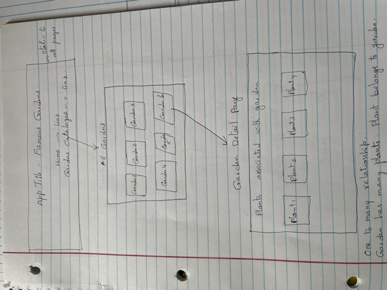
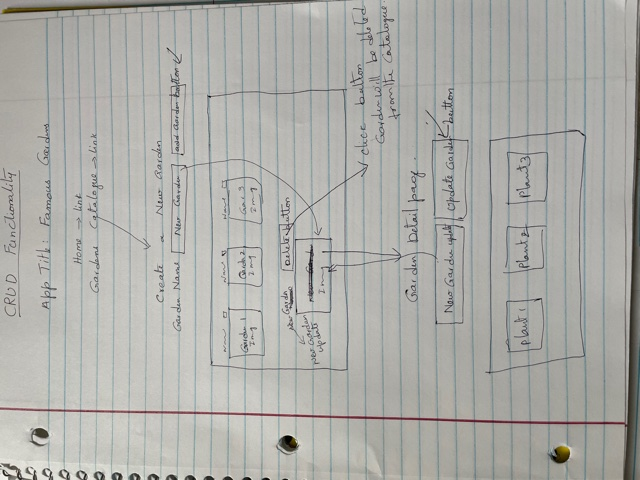

# Unit4 Project - Garden Plants
# Frontend app with React
One of my hobby is gardening. So, wanted to create an app with different gardens and associated plants.

### Project Links
- GitHub Repository: https://github.com/sp53852/Unit4-Gardens-react-frontend
- Heroku Deployment: https://gardenplantsfesharmila.herokuapp.com/

### Wireframes
 - 
 - 

## Requirements
### Technical Requirements
- 	React
-   React router Dom
-	Browser Routers 
-	Axios
-   cors
-   Javascript, HTML CSS
-   React-Bootstrap

### Main File Structure
1. index.js
2. App.js
3. AllGardens.js
4. GardenDetail.js

### User Stories:
1.	As a developer, I want to be able to setup react app for frontend.
2.	As a developer, I want to be able to see all gardens in the garden app.
3.	As a developer, I want to be able to see specific garden details i.e associated plants with the gardens.
4.  As a developer, I want to be able to implement CRUD functionality for gardens.
5.	As a developer, I want to be able to deploy front-end app with Heroku.
6.  As a developer, I want to be able to add Bootstrap framework to css. 

### Future Improvements
1. Would like to add Signup and login functions to User.
2. Would like to add CRUD functionality for User. 